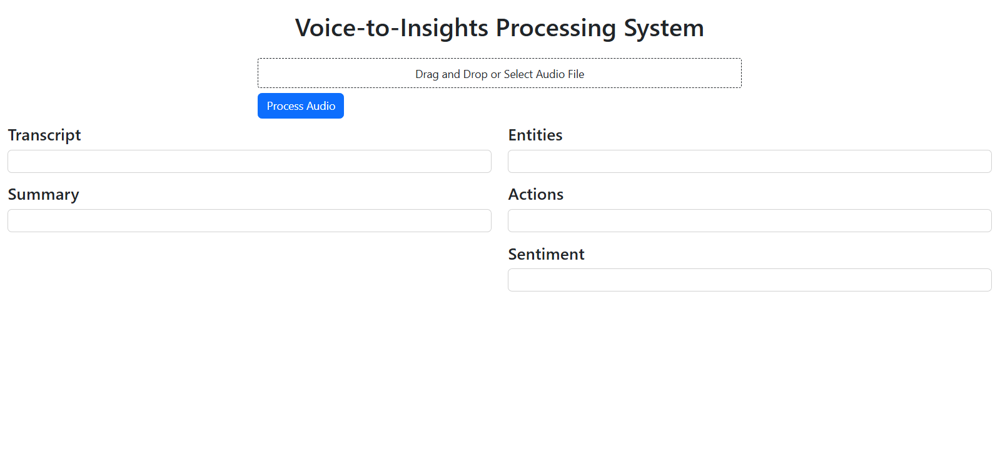
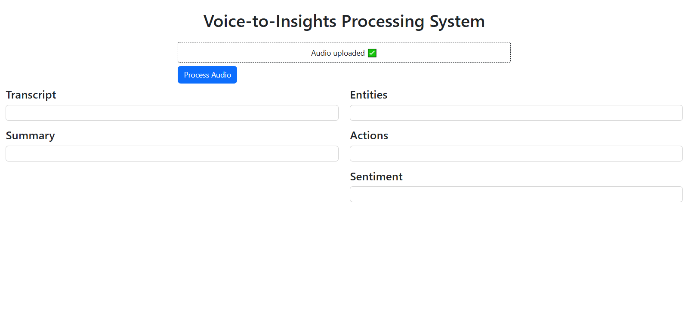
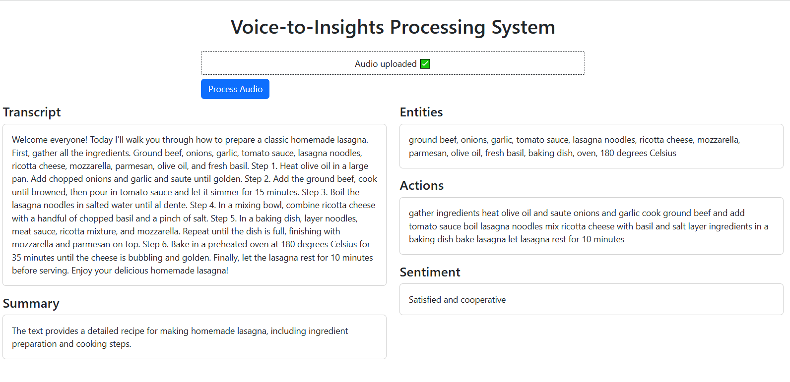

# 🎙️ Voice-to-Insights Processing System

## Overview
Voice-to-Insights is an end-to-end AI system that transforms audio files into structured, actionable insights.

The system performs:
- Speech-to-Text using **Fast Whisper**
- Structured Information Extraction using **Large Language Models**
- Sentiment Analysis
- Exposure via **FastAPI REST API**
- Interactive **Dash Web Dashboard**
- Public access via **Ngrok**

This project is designed for real-world use cases such as:
- Customer Support Analytics
- Call Center Monitoring
- Voice Assistants
- Business Intelligence from Audio Data

---
## System Pipeline
```
Audio File
↓
Whisper (Speech-to-Text)
↓
Transcript
↓
LLM (Qwen 2.5 Instruct)
↓
Structured Insights (JSON)
↓
Sentiment Analysis
↓
API / Dashboard Output
```
---
## Project Structure
```
voice_to_insights/
│
├── app/
│ ├── main.py
│ ├── api/
│ │ └── routes.py
│ ├── core/
│ │ ├── config.py
│ │ └── prompts.py
│ ├── models/
│ │ └── schemas.py
│ ├── services/
│ │ ├── transcription.py
│ │ ├── insights.py
│ │ └── sentiment.py
│ └── store/
│ └── memory.py
│
├── dash_app.py
│
├── requirements.txt
├── README.md
└── .env
```
## Technologies Used

- Python 3.10+
- Faster-Whisper
- HuggingFace Transformers
- Qwen/Qwen2.5-7B-Instruct
- PyTorch (CUDA 11.8)
- FastAPI
- Dash + Bootstrap
- Pydantic / pydantic-ai
- Ngrok

---

## Environment Variables

Create a `.env` file:

```env
HF_TOKEN=your_huggingface_token
NGROK_TOKEN=your_ngrok_token
```

## Installation (Local)
```
pip install -r requirements.txt
```
## Running the API
```
uvicorn app.main:app --host 0.0.0.0 --port 8003
```
## API Endpoints

- POST /process_audio

- GET /results/{session_id}

## Running the Dashboard
```
python dashboard/dash_app.py
```
 Ngrok will automatically generate a public URL.

 ## Example API Response
 ```
{
  "transcript": "...",
  "insights": {
    "summary": "...",
    "entities": ["Customer ID", "Order #123"],
    "actions": ["Follow up", "Escalate issue"]
  },
  "sentiment": "Frustrated but cooperative"
}
```
## Dashboard Screenshots

 
 
 


## Notes

- This project focuses on clarity, modularity, and production-ready structure.

- All AI components (Whisper, LLM, Sentiment) are isolated into services for easy scaling and maintenance.

- Tokens and secrets must always be handled through environment variables.

  
